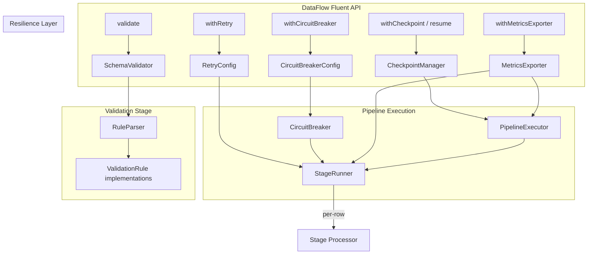

# Design Document: Enterprise Resilience

## Overview

This design introduces five production-grade resilience capabilities to the
simsoft/data-flow ETL pipeline library:

1. **Exponential Backoff with Jitter** — Retry delays that grow exponentially
   and include random jitter to prevent thundering herd synchronization.
2. **Circuit Breaker** — A per-stage state machine (Closed → Open → Half_Open)
   that fast-fails consistently broken stages.
3. **Checkpoint/Resume** — Periodic JSON checkpoint files for crash recovery,
   enabling pipelines to resume from the last saved position.
4. **Schema Validation** — A declarative validation stage that checks row data
   against a rule-based schema before further processing.
5. **Metrics Exporter** — An interface for real-time observability, with
   built-in Log and Callback implementations plus a Null no-op default.

All features are opt-in, impose zero overhead when disabled (null object
pattern), require no new Composer dependencies, and preserve full backward
compatibility with the existing fluent API and `Flowable` contract.

## Architecture



### Design Principles

- **Zero overhead when disabled**: Each feature uses the null object pattern or
  early-return guards. Disabled features add no runtime cost.
- **Immutable configuration**: `RetryConfig`, `CircuitBreakerConfig`, and
  checkpoint settings are immutable value objects created once and shared.
- **Single Responsibility**: Each resilience concern lives in its own class. The
  `StageRunner` orchestrates them but delegates behavior.
- **Backward compatibility**: All new methods are additive. Existing pipelines
  continue to work without modification.
- **No new Composer dependencies**: All implementations use PHP standard library
  features only.

## Components and Interfaces

### 1. RetryConfig (Enhanced)

Extends the existing `RetryConfig` value object with exponential backoff and
delay cap parameters.

```php
final readonly class RetryConfig
{
    public function __construct(
        public int $maxAttempts = 3,
        public int $delay = 100,          // base delay in ms
        public bool $exponential = true,   // enable exponential backoff
        public int $maxDelay = 30000,      // delay cap in ms
    );

    /** Compute delay for a given attempt number (1-based). */
    public function computeDelay(int $attempt): int;

    /** Apply ±25% jitter to a computed delay (only when exponential=true). */
    public function applyJitter(int $delayMs): int;
}
```

### 2. CircuitBreakerConfig

Immutable value object for circuit breaker parameters.

```php
final readonly class CircuitBreakerConfig
{
    public function __construct(
        public int $failureThreshold = 5,
        public int $cooldownMs = 10000,
    );
}
```

### 3. CircuitBreaker

Stateful per-stage circuit breaker implementing the Closed → Open → Half_Open
state machine.

```php
final class CircuitBreaker
{
    public function __construct(CircuitBreakerConfig $config);

    public function getState(): CircuitState;
    public function isCallAllowed(): bool;
    public function recordSuccess(): void;
    public function recordFailure(): void;
}
```

### 4. CircuitState Enum

```php
enum CircuitState: string
{
    case Closed = 'closed';
    case Open = 'open';
    case HalfOpen = 'half_open';
}
```

### 5. CheckpointManager

Handles checkpoint file I/O with atomic writes and resume logic.

```php
final class CheckpointManager
{
    public function __construct(
        string $filePath,
        int $interval = 100,
    );

    public function shouldWrite(int $rowIndex): bool;
    public function write(string $pipelineId, int $lastRowIndex, string $stageName): void;
    public function read(): ?CheckpointData;
    public function delete(): void;
    public static function generatePipelineId(array $stages): string;
}
```

### 6. CheckpointData

Immutable value object representing checkpoint file contents.

```php
final readonly class CheckpointData
{
    public function __construct(
        public string $pipelineId,
        public int $lastRowIndex,
        public string $timestamp,  // ISO 8601
        public string $stageName,
    );

    public static function fromJson(string $json): ?self;
    public function toJson(): string;
}
```

### 7. SchemaValidator (Processor)

A `Transformer` subclass that validates each row against a declared schema.

```php
final class SchemaValidator extends Transformer
{
    /** @param array<string, string|Closure> $schema */
    public function __construct(array $schema);

    public function __invoke(?Iterator $dataFrame = null): Iterator;
}
```

### 8. RuleParser

Parses pipe-delimited rule strings into executable rule objects.

```php
final class RuleParser
{
    /** @return ValidationRule[] */
    public static function parse(string $ruleString): array;
}
```

### 9. ValidationRule Interface

```php
interface ValidationRule
{
    public function passes(mixed $value): bool;
    public function message(string $field): string;
}
```

Built-in implementations: `RequiredRule`, `StringRule`, `IntRule`, `FloatRule`,
`EmailRule`, `MinRule`, `MaxRule`, `BetweenRule`, `InRule`, `RegexRule`,
`ClosureRule`.

### 10. MetricsExporter Interface

```php
interface MetricsExporter
{
    public function recordRowProcessed(string $stageName): void;
    public function recordRowFailed(string $stageName, string $errorMessage): void;
    public function recordStageDuration(string $stageName, float $durationMs): void;
    public function recordPipelineComplete(float $totalDurationMs, int $processedRows, int $failedRows): void;
}
```

### 11. NullMetricsExporter

```php
final class NullMetricsExporter implements MetricsExporter
{
    // All methods are no-ops
}
```

### 12. LogMetricsExporter

```php
final class LogMetricsExporter implements MetricsExporter
{
    public function __construct(LoggerInterface $logger);
}
```

### 13. CallbackMetricsExporter

```php
final class CallbackMetricsExporter implements MetricsExporter
{
    public function __construct(
        ?Closure $onRowProcessed = null,
        ?Closure $onRowFailed = null,
        ?Closure $onStageDuration = null,
        ?Closure $onPipelineComplete = null,
    );
}
```

### 14. Enhanced Processor (withRetry / withCircuitBreaker)

```php
abstract class Processor implements Flowable
{
    // Existing...
    public function withRetry(
        int $maxAttempts = 3,
        int $delay = 100,
        bool $exponential = true,
        int $maxDelay = 30000,
    ): static;

    public function withCircuitBreaker(
        int $failureThreshold = 5,
        int $cooldownMs = 10000,
    ): static;

    public function getCircuitBreakerConfig(): ?CircuitBreakerConfig;
}
```

### 15. Enhanced DataFlow

```php
class DataFlow
{
    // Existing...
    public function withCheckpoint(string $path, int $interval = 100): static;
    public function resume(): static;
    public function validate(array $schema): static;
    public function withMetricsExporter(MetricsExporter $exporter): static;
}
```

## Data Models

### RetryConfig (Enhanced)

| Property    | Type | Default | Description                             |
|-------------|------|---------|-----------------------------------------|
| maxAttempts | int  | 3       | Maximum retry attempts (≥ 1)            |
| delay       | int  | 100     | Base delay in milliseconds (≥ 0)        |
| exponential | bool | true    | Enable exponential backoff              |
| maxDelay    | int  | 30000   | Maximum delay cap in milliseconds (≥ 1) |

### CircuitBreakerConfig

| Property         | Type | Default | Description                                 |
|------------------|------|---------|---------------------------------------------|
| failureThreshold | int  | 5       | Consecutive failures to open circuit        |
| cooldownMs       | int  | 10000   | Milliseconds in Open state before Half_Open |

### CircuitBreaker (Internal State)

| Property            | Type         | Description                            |
|---------------------|--------------|----------------------------------------|
| state               | CircuitState | Current state (Closed/Open/HalfOpen)   |
| consecutiveFailures | int          | Failure counter (resets on success)    |
| openedAt            | float        | Timestamp (hrtime) when circuit opened |

### CheckpointData

| Property     | Type   | Description                                 |
|--------------|--------|---------------------------------------------|
| pipelineId   | string | Deterministic hash of pipeline stage config |
| lastRowIndex | int    | Index of last successfully checkpointed row |
| timestamp    | string | ISO 8601 timestamp of checkpoint write      |
| stageName    | string | Name of the stage at checkpoint time        |

### Schema Definition Format

```php
// Schema is an associative array: field => rules
$schema = [
    'email'  => 'required|email',
    'age'    => 'required|int|min:0|max:150',
    'status' => 'required|in:active,inactive,pending',
    'name'   => 'required|string|regex:/^[A-Za-z ]+$/',
    'score'  => fn(mixed $v): bool => is_numeric($v) && $v >= 0,
];
```

### Validation Rule Parameters

| Rule        | Format            | Passes When                                     |
|-------------|-------------------|-------------------------------------------------|
| required    | `required`        | Value is not null, not empty string, key exists |
| string      | `string`          | Value is of type string                         |
| int         | `int`             | Value is of type integer                        |
| float       | `float`           | Value is float or integer                       |
| email       | `email`           | Passes `filter_var(FILTER_VALIDATE_EMAIL)`      |
| min:N       | `min:N`           | Numeric value ≥ N                               |
| max:N       | `max:N`           | Numeric value ≤ N                               |
| between:M,N | `between:M,N`     | M ≤ numeric value ≤ N                           |
| in:a,b,c    | `in:a,b,c`        | Value is in the specified list                  |
| regex:/p/   | `regex:/pattern/` | Value matches the regex pattern                 |

### MetricsExporter Event Payloads

| Method                 | Parameters                                                  | Timing                       |
|------------------------|-------------------------------------------------------------|------------------------------|
| recordRowProcessed     | stageName: string                                           | After each row exits a stage |
| recordRowFailed        | stageName: string, errorMessage: string                     | After failure is handled     |
| recordStageDuration    | stageName: string, durationMs: float                        | After stage completes        |
| recordPipelineComplete | totalDurationMs: float, processedRows: int, failedRows: int | After pipeline finishes      |

### PipelineResult (Enhanced)

Additional data exposed:

| Property      | Type                        | Description                                                        |
|---------------|-----------------------------|--------------------------------------------------------------------|
| circuitStates | array<string, CircuitState> | Final circuit state per stage (only for stages with CB configured) |

## Correctness Properties

*A property is a characteristic or behavior that should hold true across all
valid executions of a system — essentially, a formal statement about what the
system should do. Properties serve as the bridge between human-readable
specifications and machine-verifiable correctness guarantees.*

### Property 1: Exponential delay computation with clamping

*For any* valid RetryConfig with exponential=true, and *for any* attempt
number ≥ 1, `computeDelay(attempt)` SHALL return
`min(base_delay × 2^(attempt-1), maxDelay)`.

**Validates: Requirements 1.1, 1.5**

### Property 2: Linear delay is constant

*For any* valid RetryConfig with exponential=false, and *for any* attempt
number ≥ 1, `computeDelay(attempt)` SHALL always return exactly `base_delay`.

**Validates: Requirements 1.3**

### Property 3: Jitter bounds invariant

*For any* computed delay value and *for any* application of jitter, the
resulting jittered delay SHALL be within the range
`[computedDelay × 0.75, min(computedDelay × 1.25, maxDelay)]`.

**Validates: Requirements 2.1, 2.2, 2.3**

### Property 4: Linear mode applies no jitter

*For any* RetryConfig with exponential=false, and *for any* attempt, the final
delay SHALL always equal exactly `base_delay` with zero variance across repeated
invocations.

**Validates: Requirements 2.4**

### Property 5: Circuit breaker state determines call allowance

*For any* CircuitBreaker instance, `isCallAllowed()` SHALL return true when
state is Closed, and SHALL return false when state is Open (before cooldown
expiry).

**Validates: Requirements 3.2, 3.4**

### Property 6: Failure threshold triggers Open state

*For any* CircuitBreaker with failure threshold N, recording exactly N
consecutive failures from the Closed state SHALL transition the state to Open.

**Validates: Requirements 3.3**

### Property 7: Success in Closed state resets failure counter

*For any* CircuitBreaker in the Closed state with K consecutive failures (where
K < threshold), recording a success SHALL reset the consecutive failure counter
to zero.

**Validates: Requirements 3.9**

### Property 8: HalfOpen probe outcome determines transition

*For any* CircuitBreaker in the HalfOpen state, recording a success SHALL
transition to Closed with failure counter reset to zero, and recording a failure
SHALL transition to Open.

**Validates: Requirements 3.7, 3.8**

### Property 9: Open circuit records skipped rows in dead letters

*For any* row skipped due to an Open circuit breaker, the row SHALL appear in
the DeadLetterCollection with a circuit-open indication.

**Validates: Requirements 4.6**

### Property 10: Checkpoint interval fires at correct row indices

*For any* checkpoint interval N, `shouldWrite(rowIndex)` SHALL return true if
and only if `rowIndex` is a positive multiple of N.

**Validates: Requirements 5.2**

### Property 11: Checkpoint data round-trip serialization

*For any* valid CheckpointData object, serializing to JSON and deserializing
back SHALL produce an equivalent CheckpointData object with identical
pipelineId, lastRowIndex, timestamp, and stageName.

**Validates: Requirements 5.3**

### Property 12: Deterministic pipeline ID

*For any* set of pipeline stages, calling `generatePipelineId()` multiple times
with the same stage configuration SHALL always produce the same pipeline ID
string.

**Validates: Requirements 5.4**

### Property 13: Resume skips correct number of rows

*For any* valid checkpoint with lastRowIndex=N, resuming the pipeline SHALL skip
exactly the first N rows and begin processing at row N+1.

**Validates: Requirements 6.2**

### Property 14: Validation exception contains field and rule

*For any* field name and *for any* validation rule that fails, the thrown
exception message SHALL contain both the field name and the name of the failing
rule.

**Validates: Requirements 7.5**

### Property 15: Closure rule invocation

*For any* field value and *for any* closure provided as a validation rule, the
SchemaValidator SHALL treat a `false` return from the closure as a validation
failure and a `true` return as passing.

**Validates: Requirements 7.7**

### Property 16: Required rule semantics

*For any* row, the `required` rule SHALL fail if and only if the field value is
null, an empty string, or the field key is absent from the row.

**Validates: Requirements 8.1**

### Property 17: Type checking rules

*For any* value, the `string` rule SHALL pass iff `is_string($value)` is true,
the `int` rule SHALL pass iff `is_int($value)` is true, and the `float` rule
SHALL pass iff `is_float($value) || is_int($value)` is true.

**Validates: Requirements 8.2, 8.3, 8.4**

### Property 18: Email rule matches filter_var

*For any* string value, the `email` rule SHALL pass if and only if
`filter_var($value, FILTER_VALIDATE_EMAIL)` returns a non-false result.

**Validates: Requirements 8.5**

### Property 19: Numeric bound rules

*For any* numeric value V and bounds M, N: `min:N` passes iff V ≥ N; `max:N`
passes iff V ≤ N; `between:M,N` passes iff M ≤ V ≤ N.

**Validates: Requirements 8.6, 8.7, 8.8**

### Property 20: In-list rule

*For any* value and *for any* list of allowed values, the `in` rule SHALL pass
if and only if the value is a member of the list.

**Validates: Requirements 8.9**

### Property 21: Regex rule matches preg_match

*For any* string value and *for any* valid regex pattern, the `regex` rule SHALL
pass if and only if `preg_match($pattern, $value)` returns 1.

**Validates: Requirements 8.10**

### Property 22: Optional field skips validation when null or absent

*For any* schema where a field is NOT marked as `required`, if the field value
is null or the field key is absent from the row, ALL other rules for that field
SHALL be skipped (no failure).

**Validates: Requirements 8.11**

### Property 23: Metrics exporter receives correct event counts

*For any* pipeline execution with a configured MetricsExporter,
`recordRowProcessed()` SHALL be called once per successfully processed row per
stage, `recordRowFailed()` once per failed row, and `recordStageDuration()` once
per stage.

**Validates: Requirements 9.3, 9.4, 9.5**

### Property 24: LogMetricsExporter log messages contain event parameters

*For any* stage name, error message, duration, and row counts passed to
LogMetricsExporter methods, the resulting log message SHALL contain all provided
parameter values as substrings.

**Validates: Requirements 10.3, 10.4, 10.5, 10.6**

### Property 25: CallbackMetricsExporter forwards parameters to closures

*For any* event parameters passed to CallbackMetricsExporter methods, the
configured closure SHALL receive exactly those parameters in the correct order.

**Validates: Requirements 11.3**

## Error Handling

### Retry with Exponential Backoff

- When a stage configured with `withRetry()` throws an exception, the
  `StageRunner` computes the delay via `RetryConfig::computeDelay()` and applies
  jitter (if exponential mode).
- The row is retried up to `maxAttempts` times. If all attempts fail, the row is
  added to the `DeadLetterCollection` and the `onError` callback is invoked.
- Delay is applied via `usleep()` between attempts.

### Circuit Breaker

- When a circuit breaker is configured and transitions to Open, all subsequent
  rows for that stage are skipped without invoking the processor.
- Skipped rows are recorded in the `DeadLetterCollection` with a `circuit-open`
  reason string.
- The circuit breaker uses `hrtime(true)` for cooldown timing to avoid
  wall-clock drift issues.
- If the probe row in HalfOpen state fails, the circuit re-opens and the
  cooldown restarts.

### Schema Validation

- Validation failures throw a `ValidationException` (extends
  `DataFlowException`) containing the field name and failing rule.
- The exception is handled by the stage's configured `ErrorStrategy` (Throw,
  Skip, Retry, LogAndContinue).
- When a field is optional (no `required` rule) and the value is null/absent,
  all other rules are skipped — no exception is thrown.

### Checkpoint

- If the checkpoint file cannot be written (permissions, disk full), a
  `DataFlowException` is thrown.
- If the checkpoint file is corrupted (invalid JSON),
  `CheckpointData::fromJson()` returns null, and the pipeline starts from the
  beginning with a warning log.
- Atomic writes (temp file + rename) prevent partial checkpoint corruption.

### Metrics Exporter

- The `NullMetricsExporter` is used by default, ensuring no exceptions from
  metrics code when no exporter is configured.
- If a user-provided `MetricsExporter` throws an exception, it is caught and
  logged at warning level — it does not interrupt pipeline execution.

## Testing Strategy

### Property-Based Testing

This feature is well-suited for property-based testing due to its pure
computational logic (delay formulas, state machines, validation rules,
serialization).

**Library**: [PHPUnit with custom property test helpers](https://phpunit.de/) —
we will implement a lightweight `forAll` helper using PHP generators to run each
property 100+ iterations with random inputs. No external PBT library is required
since PHPUnit is already the test framework.

**Configuration**:

- Minimum 100 iterations per property test
- Each property test references its design document property via a tag comment
- Tag format:
  `Feature: enterprise-resilience, Property {number}: {property_text}`

### Unit Tests (Example-Based)

Unit tests cover specific examples, defaults, API contracts, and edge cases:

- RetryConfig default values (exponential=true, maxDelay=30000)
- withRetry() / withCircuitBreaker() fluent API returns
- CircuitState enum has exactly three cases
- HalfOpen allows exactly one probe row
- Checkpoint file deletion on successful completion
- Resume with no file starts from beginning
- Resume with mismatched pipeline ID starts from beginning and logs warning
- SchemaValidator stage insertion at correct pipeline position
- NullMetricsExporter is used when none configured
- CallbackMetricsExporter with null closures performs no operation
- LogMetricsExporter uses correct log levels (info vs warning)

### Integration Tests

Integration tests verify cross-component behavior:

- Full pipeline execution with retry + exponential backoff (verify row
  eventually succeeds)
- Circuit breaker opening during pipeline execution (verify rows are skipped)
- Checkpoint write + crash simulation + resume (verify correct rows are skipped)
- Schema validation with error strategy integration (Skip, LogAndContinue)
- Metrics exporter real-time emission ordering (calls interleave with
  processing)
- Atomic checkpoint file write (temp file + rename)

### Test Organization

```
tests/
├── Unit/
│   ├── RetryConfigTest.php
│   ├── CircuitBreakerTest.php
│   ├── CircuitBreakerConfigTest.php
│   ├── CheckpointManagerTest.php
│   ├── CheckpointDataTest.php
│   ├── SchemaValidatorTest.php
│   ├── RuleParserTest.php
│   ├── Rules/
│   │   ├── RequiredRuleTest.php
│   │   ├── StringRuleTest.php
│   │   ├── IntRuleTest.php
│   │   ├── FloatRuleTest.php
│   │   ├── EmailRuleTest.php
│   │   ├── MinRuleTest.php
│   │   ├── MaxRuleTest.php
│   │   ├── BetweenRuleTest.php
│   │   ├── InRuleTest.php
│   │   ├── RegexRuleTest.php
│   │   └── ClosureRuleTest.php
│   ├── LogMetricsExporterTest.php
│   ├── CallbackMetricsExporterTest.php
│   └── NullMetricsExporterTest.php
├── Property/
│   ├── RetryDelayPropertyTest.php
│   ├── JitterBoundsPropertyTest.php
│   ├── CircuitBreakerPropertyTest.php
│   ├── CheckpointPropertyTest.php
│   ├── SchemaValidationPropertyTest.php
│   └── MetricsExporterPropertyTest.php
└── Integration/
    ├── RetryPipelineTest.php
    ├── CircuitBreakerPipelineTest.php
    ├── CheckpointResumePipelineTest.php
    ├── SchemaValidationPipelineTest.php
    └── MetricsEmissionPipelineTest.php
```

