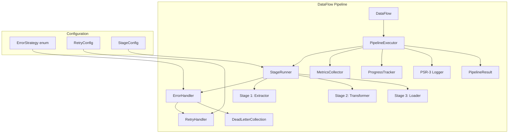
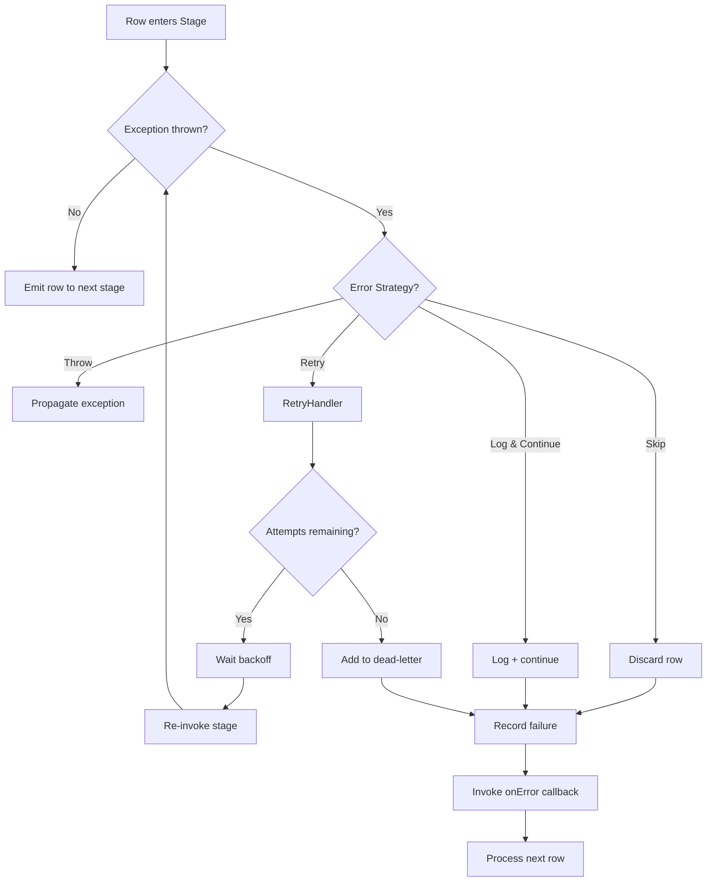

# Design Document: Production Readiness

## Overview

This design introduces production-readiness capabilities to the
simsoft/data-flow ETL pipeline library. The enhancements fall into four pillars:

1. **Error Handling** — Configurable per-stage error strategies (throw, skip,
   retry, log-and-continue), global error callback, retry with backoff,
   dead-letter collection, and partial failure reporting.
2. **Observability** — PSR-3 logger injection, automatic stage boundary logging,
   row-level failure logging, and pipeline run metadata.
3. **Execution Control** — Pipeline result object, progress callback support,
   and dry-run mode.
4. **Dependency Modernization** — Migration from vendored Box\Spout to
   openspout/openspout and removal of the vendored directory.

### Design Rationale

The current `DataFlow` class executes stages in a simple iterator chain with no
error recovery, no metrics, and no logging. Any exception propagates
immediately, halting the entire pipeline. This is unsuitable for production
workloads where partial failures are expected and visibility is critical.

The design preserves the existing `Flowable` contract (
`__invoke(?Iterator): Iterator`) and the lazy iterator-based architecture. New
capabilities are layered on top through:

- A decorator pattern wrapping stage iterators with error-handling logic
- Trait-based composition for cross-cutting concerns (logging, metrics)
- Value objects for configuration and results

## Architecture



### Key Architectural Decisions

1. **Decorator over inheritance**: Stage error handling wraps the existing
   iterator output rather than modifying `Processor` internals. This preserves
   backward compatibility.

2. **Internal executor**: A new `PipelineExecutor` class encapsulates the run
   logic extracted from `DataFlow::run()`. This separates orchestration concerns
   from the fluent API.

3. **Trait for dry-run**: The `DryRunAware` trait is mixed into `Loader` so
   loaders can check `$this->isDryRun()` before performing writes. This avoids
   modifying the `Flowable` contract.

4. **Value objects for config**: `ErrorStrategy` (enum), `RetryConfig`, and
   `StageMetrics` are immutable value objects. This ensures thread-safety and
   simplifies testing.

5. **NullLogger default**: When no logger is injected, a `NullLogger` (PSR-3
   compliant no-op) is used. This eliminates null checks throughout the
   codebase.

## Components and Interfaces

### New Enums

```php
namespace Simsoft\DataFlow\Enums;

enum ErrorStrategy: string
{
    case Throw = 'throw';
    case Skip = 'skip';
    case Retry = 'retry';
    case LogAndContinue = 'log-and-continue';
}
```

### New Value Objects

```php
namespace Simsoft\DataFlow;

final readonly class RetryConfig
{
    public function __construct(
        public int $maxAttempts = 3,
        public int $delay = 100,
    ) {
        if ($this->maxAttempts < 1) {
            throw new \InvalidArgumentException('maxAttempts must be >= 1');
        }
        if ($this->delay < 0) {
            throw new \InvalidArgumentException('delay must be >= 0');
        }
    }
}
```

```php
namespace Simsoft\DataFlow;

final readonly class DeadLetterEntry
{
    public function __construct(
        public mixed $row,
        public string $stageName,
        public int $rowIndex,
        public \Throwable $exception,
        public \DateTimeImmutable $occurredAt = new \DateTimeImmutable(),
    ) {}
}
```

```php
namespace Simsoft\DataFlow;

final class DeadLetterCollection implements \Countable, \IteratorAggregate
{
    /** @var DeadLetterEntry[] */
    private array $entries = [];

    public function add(DeadLetterEntry $entry): void { ... }
    public function count(): int { ... }
    public function getIterator(): \ArrayIterator { ... }
    /** @return DeadLetterEntry[] */
    public function toArray(): array { ... }
}
```

```php
namespace Simsoft\DataFlow;

final readonly class StageMetrics
{
    public function __construct(
        public string $stageName,
        public int $rowsEntered,
        public int $rowsExited,
        public float $durationMs,
    ) {}
}
```

```php
namespace Simsoft\DataFlow;

final class PipelineResult
{
    public function __construct(
        private \DateTimeImmutable $startTime,
        private \DateTimeImmutable $endTime,
        private int $processedRows,
        private int $failedRows,
        private float $durationMs,
        private int $peakMemoryBytes,
        private bool $isDryRun,
        /** @var StageMetrics[] */
        private array $stageMetrics,
        private DeadLetterCollection $deadLetters,
        /** @var array{row: mixed, stageName: string, message: string, rowIndex: int}[] */
        private array $failures,
    ) {}

    public function getStartTime(): \DateTimeImmutable { ... }
    public function getEndTime(): \DateTimeImmutable { ... }
    public function getProcessedRows(): int { ... }
    public function getFailedRows(): int { ... }
    public function getDurationMs(): float { ... }
    public function getPeakMemoryBytes(): int { ... }
    public function isDryRun(): bool { ... }
    /** @return StageMetrics[] */
    public function getStageMetrics(): array { ... }
    public function getDeadLetters(): DeadLetterCollection { ... }
    /** @return array{row: mixed, stageName: string, message: string, rowIndex: int}[] */
    public function getFailures(): array { ... }

    /** @return array<string, mixed> */
    public function toArray(): array { ... }
}
```

### New Internal Classes

```php
namespace Simsoft\DataFlow;

use Psr\Log\LoggerInterface;

final class PipelineExecutor
{
    public function __construct(
        private LoggerInterface $logger,
        private DeadLetterCollection $deadLetters,
        private ?callable $onError = null,
        private ?callable $onProgress = null,
        private int $progressInterval = 100,
        private bool $dryRun = false,
    ) {}

    /**
     * Execute the full pipeline and return metrics.
     *
     * @param Iterator|null $dataFrame
     * @param Processor[] $stages
     * @return PipelineResult
     */
    public function execute(?Iterator $dataFrame, array $stages): PipelineResult { ... }
}
```

```php
namespace Simsoft\DataFlow;

use Psr\Log\LoggerInterface;

final class StageRunner
{
    /**
     * Wrap a stage's iterator output with error handling and metrics.
     *
     * @return Iterator
     */
    public function run(
        Processor $stage,
        ?Iterator $input,
        ErrorStrategy $strategy,
        ?RetryConfig $retryConfig,
        LoggerInterface $logger,
        DeadLetterCollection $deadLetters,
        ?callable $onError,
    ): Iterator { ... }
}
```

### Modified Classes

#### `Processor` (additions)

```php
abstract class Processor implements Flowable
{
    // ... existing code ...

    private ErrorStrategy $errorStrategy = ErrorStrategy::Throw;
    private ?RetryConfig $retryConfig = null;
    private ?string $name = null;

    public function withErrorStrategy(ErrorStrategy $strategy): static
    {
        $this->errorStrategy = $strategy;
        return $this;
    }

    public function withRetry(int $maxAttempts = 3, int $delay = 100): static
    {
        $this->errorStrategy = ErrorStrategy::Retry;
        $this->retryConfig = new RetryConfig($maxAttempts, $delay);
        return $this;
    }

    public function getErrorStrategy(): ErrorStrategy { ... }
    public function getRetryConfig(): ?RetryConfig { ... }

    public function withName(string $name): static
    {
        $this->name = $name;
        return $this;
    }

    public function getName(): string
    {
        return $this->name ?? static::class;
    }
}
```

#### `Loader` (additions)

```php
abstract class Loader extends Processor
{
    private bool $dryRun = false;

    public function setDryRun(bool $dryRun): void
    {
        $this->dryRun = $dryRun;
    }

    public function isDryRun(): bool
    {
        return $this->dryRun;
    }
}
```

#### `DataFlow` (additions)

```php
class DataFlow
{
    // ... existing code ...

    private LoggerInterface $logger;
    private ?callable $onError = null;
    private ?callable $onProgress = null;
    private int $progressInterval = 100;
    private bool $dryRun = false;

    /** @var Processor[] Registered stages for executor */
    private array $stages = [];

    public function withLogger(LoggerInterface $logger): static
    {
        $this->logger = $logger;
        return $this;
    }

    public function onError(callable $callback): static
    {
        $this->onError = $callback;
        return $this;
    }

    public function onProgress(callable $callback, int $interval = 100): static
    {
        $this->onProgress = $callback;
        $this->progressInterval = $interval;
        return $this;
    }

    public function dryRun(bool $enabled = true): static
    {
        $this->dryRun = $enabled;
        return $this;
    }

    /**
     * Run flow and return result.
     *
     * @return PipelineResult
     */
    public function run(): PipelineResult { ... }
}
```

### NullLogger

```php
namespace Simsoft\DataFlow\Logging;

use Psr\Log\AbstractLogger;
use Stringable;

final class NullLogger extends AbstractLogger
{
    public function log(mixed $level, string|Stringable $message, array $context = []): void
    {
        // No-op
    }
}
```

### OpenSpout Migration

The `SpoutExtractor`, `SpoutLoader`, and `SpoutIO` classes will have their `use`
statements updated from `Box\Spout\*` to `OpenSpout\*` namespaces. The OpenSpout
API is largely compatible with Box\Spout but uses different class names:

| Box\Spout                                     | OpenSpout                                                          |
|-----------------------------------------------|--------------------------------------------------------------------|
| `ReaderEntityFactory::createReaderFromFile()` | `\OpenSpout\Reader\Common\Creator\ReaderFactory::createFromFile()` |
| `WriterEntityFactory::createWriterFromFile()` | `\OpenSpout\Writer\Common\Creator\WriterFactory::createFromFile()` |
| `WriterEntityFactory::createRowFromArray()`   | `\OpenSpout\Common\Entity\Row::fromValues()`                       |
| `Box\Spout\Reader\ReaderInterface`            | `\OpenSpout\Reader\ReaderInterface`                                |
| `Box\Spout\Writer\WriterInterface`            | `\OpenSpout\Writer\WriterInterface`                                |
| `Box\Spout\Common\Entity\Cell`                | `\OpenSpout\Common\Entity\Cell`                                    |
| `Box\Spout\Common\Entity\Style\Style`         | `\OpenSpout\Common\Entity\Style\Style`                             |
| `StyleBuilder`                                | `\OpenSpout\Common\Entity\Style\Style` (direct construction)       |

## Data Models

### ErrorStrategy Enum

```php
enum ErrorStrategy: string
{
    case Throw = 'throw';           // Propagate exception immediately
    case Skip = 'skip';             // Discard row, continue pipeline
    case Retry = 'retry';           // Re-attempt with backoff
    case LogAndContinue = 'log-and-continue'; // Log error, continue with next row
}
```

### RetryConfig Value Object

| Property    | Type | Default | Constraint |
|-------------|------|---------|------------|
| maxAttempts | int  | 3       | >= 1       |
| delay       | int  | 100     | >= 0       |

### DeadLetterEntry Value Object

| Property   | Type              | Description                              |
|------------|-------------------|------------------------------------------|
| row        | mixed             | The original row data that failed        |
| stageName  | string            | Name of the stage where failure occurred |
| rowIndex   | int               | Zero-based index of the row in the input |
| exception  | Throwable         | The exception that caused the failure    |
| occurredAt | DateTimeImmutable | Timestamp of the failure                 |

### PipelineResult

| Property        | Type                 | Description                             |
|-----------------|----------------------|-----------------------------------------|
| startTime       | DateTimeImmutable    | Pipeline execution start                |
| endTime         | DateTimeImmutable    | Pipeline execution end                  |
| processedRows   | int                  | Rows that passed through all stages     |
| failedRows      | int                  | Rows that failed (non-throw strategies) |
| durationMs      | float                | Total execution time                    |
| peakMemoryBytes | int                  | Peak memory during run                  |
| isDryRun        | bool                 | Whether this was a dry run              |
| stageMetrics    | StageMetrics[]       | Per-stage timing and counts             |
| deadLetters     | DeadLetterCollection | Failed rows collection                  |
| failures        | array[]              | Failure detail records                  |

### StageMetrics Value Object

| Property    | Type   | Description            |
|-------------|--------|------------------------|
| stageName   | string | Stage identifier       |
| rowsEntered | int    | Rows received by stage |
| rowsExited  | int    | Rows emitted by stage  |
| durationMs  | float  | Time spent in stage    |

### Failure Record Structure

```php
[
    'row' => mixed,          // Original row data
    'stageName' => string,   // Stage where failure occurred
    'message' => string,     // Exception message
    'rowIndex' => int,       // Row position in input
]
```

## Correctness Properties

*A property is a characteristic or behavior that should hold true across all
valid executions of a system — essentially, a formal statement about what the
system should do. Properties serve as the bridge between human-readable
specifications and machine-verifiable correctness guarantees.*

### Property 1: Throw Strategy Propagates Exceptions

*For any* row that causes an exception in a stage configured with the `throw`
error strategy, the pipeline SHALL propagate that exception immediately without
catching it, and no subsequent rows SHALL be processed.

**Validates: Requirements 1.3**

### Property 2: Skip Strategy Excludes Failing Rows

*For any* sequence of rows processed by a stage configured with the `skip` error
strategy, the output iterator SHALL contain exactly those rows that did not
cause an exception, in their original order.

**Validates: Requirements 1.4**

### Property 3: Retry Strategy Invokes Stage N Times

*For any* row that causes an exception in a stage configured with the `retry`
error strategy and a `maxAttempts` of N, the stage SHALL be invoked exactly N
times for that row before the row is considered failed.

**Validates: Requirements 1.5**

### Property 4: Log-and-Continue Preserves Subsequent Row Data

*For any* sequence of rows where some rows cause exceptions in a stage
configured with `log-and-continue`, all non-failing rows SHALL pass through with
their original data unmodified, and the pipeline SHALL continue processing after
each failure.

**Validates: Requirements 1.6**

### Property 5: Global Error Callback Receives Correct Arguments

*For any* stage exception under a non-throw error strategy, when an `onError`
callback is registered, the callback SHALL be invoked with exactly three
arguments: the thrown exception, the failing row data, and the stage name
string.

**Validates: Requirements 2.2**

### Property 6: Retry Backoff Delay Is Applied

*For any* retry configuration with `delay` of D and `maxAttempts` of N where all
attempts fail, the total elapsed time for processing that row SHALL be at
least (N - 1) × D milliseconds.

**Validates: Requirements 3.3**

### Property 7: Retry Exhaustion Adds to Dead-Letter Collection

*For any* row that exhausts all retry attempts, the dead-letter collection SHALL
contain an entry with that row's data, the stage name, the row index, and the
final exception.

**Validates: Requirements 3.4, 5.2**

### Property 8: Failure Records Contain Complete Metadata

*For any* row that fails processing under skip, retry-exhausted, or
log-and-continue strategies, the failure record SHALL contain the original row
data, the stage name, the exception message, and the row index.

**Validates: Requirements 4.1, 5.2**

### Property 9: Row Count Invariant

*For any* pipeline execution, the sum of `processedRows + failedRows` SHALL
equal the total number of rows that entered the first stage.

**Validates: Requirements 4.2, 4.3, 9.3, 9.4, 9.5**

### Property 10: Stage Boundary Logging

*For any* stage in the pipeline, a debug-level log message containing the stage
name SHALL be emitted when the stage begins processing, and an info-level log
message containing the stage name and the row count SHALL be emitted when the
stage completes.

**Validates: Requirements 7.1, 7.2**

### Property 11: Failure Logging at Appropriate Levels

*For any* row that fails processing in a stage, the pipeline SHALL emit both an
error-level log (containing stage name, exception message, and row index) and a
warning-level log (containing row index, stage name, and exception message).

**Validates: Requirements 7.3, 8.1**

### Property 12: Row Data Appears in Debug Context Only

*For any* row failure, the warning-level log message SHALL NOT contain the full
row data, but the debug-level log context array SHALL include the complete row
data.

**Validates: Requirements 8.2, 8.3**

### Property 13: Duration Equals Time Difference

*For any* pipeline execution, the `durationMs` value SHALL equal the difference
between `endTime` and `startTime` converted to milliseconds (within a 1ms
tolerance).

**Validates: Requirements 9.6**

### Property 14: Per-Stage Metrics Consistency

*For any* pipeline with multiple stages, the per-stage `rowsEntered` values
SHALL be monotonically non-increasing (each stage receives at most as many rows
as the previous stage emitted), and the sum of per-stage `durationMs` values
SHALL not exceed the total `durationMs`.

**Validates: Requirements 10.2, 10.3**

### Property 15: PipelineResult Serialization Round-Trip

*For any* `PipelineResult` object, calling `toArray()` SHALL produce an
associative array containing keys for all public properties, and the values
SHALL match the corresponding getter return values.

**Validates: Requirements 10.4**

### Property 16: Progress Callback Invocation Frequency

*For any* pipeline configured with a progress callback at interval N processing
T total rows, the callback SHALL be invoked exactly `floor(T / N)` times, and
each invocation SHALL receive the current cumulative row count and elapsed time
in milliseconds.

**Validates: Requirements 11.3**

### Property 17: Dry-Run Equivalence for Non-Loader Stages

*For any* pipeline in dry-run mode, extractors and transformers SHALL produce
identical output rows as they would in normal mode, and the `PipelineResult` row
counts SHALL reflect the rows that would have been written.

**Validates: Requirements 12.2, 12.5**

### Property 18: Dry-Run Suppresses Loader Side Effects

*For any* loader stage in dry-run mode, the loader SHALL receive all rows (its
`__invoke` is called) but SHALL NOT perform actual write operations (file I/O,
database inserts, API calls).

**Validates: Requirements 12.3**

## Error Handling

### Error Flow by Strategy



### Exception Hierarchy (unchanged)

The existing exception hierarchy (`DataFlowException`, `ExtractorException`,
`TransformerException`, `LoaderException`) remains unchanged. All stage
exceptions are caught by the `StageRunner` and handled according to the
configured `ErrorStrategy`.

### Error Callback Signature

```php
/**
 * @param \Throwable $exception The caught exception
 * @param mixed $row The row that caused the failure
 * @param string $stageName The name of the failing stage
 */
callable(\Throwable $exception, mixed $row, string $stageName): void
```

### Validation Errors

- `RetryConfig` with `maxAttempts < 1` throws `\InvalidArgumentException`
- `RetryConfig` with `delay < 0` throws `\InvalidArgumentException`
- Progress interval `< 1` throws `\InvalidArgumentException`

## Testing Strategy

### Property-Based Testing

This feature is well-suited for property-based testing because the core
error-handling, metrics, and logging behaviors are universal properties that
should hold across all valid inputs (any row data, any stage configuration, any
failure pattern).

**Library**: [phpunit/phpunit](https://phpunit.de/) with a custom PBT helper
using random data generators (PHP does not have a mature PBT library like
QuickCheck, so we implement lightweight generators using `random_int`,
`array_rand`, and faker-style helpers).

**Alternative**: Use [eris/eris](https://github.com/giorgiosironi/eris) — a
property-based testing library for PHPUnit.

**Configuration**:

- Minimum 100 iterations per property test
- Each test tagged with: `Feature: production-readiness, Property {N}: {title}`

### Test Organization

```
tests/
├── Properties/
│   ├── ErrorStrategyPropertyTest.php    # Properties 1-4
│   ├── ErrorCallbackPropertyTest.php    # Property 5
│   ├── RetryPropertyTest.php            # Properties 6-7
│   ├── FailureRecordPropertyTest.php    # Properties 8-9
│   ├── LoggingPropertyTest.php          # Properties 10-12
│   ├── MetricsPropertyTest.php          # Properties 13-14
│   ├── ResultPropertyTest.php           # Property 15
│   ├── ProgressPropertyTest.php         # Property 16
│   └── DryRunPropertyTest.php           # Properties 17-18
├── Unit/
│   ├── ErrorStrategyEnumTest.php
│   ├── RetryConfigTest.php
│   ├── DeadLetterCollectionTest.php
│   ├── PipelineResultTest.php
│   ├── StageMetricsTest.php
│   ├── NullLoggerTest.php
│   └── PipelineExecutorTest.php
├── Integration/
│   ├── OpenSpoutMigrationTest.php       # Req 13-14
│   └── FullPipelineTest.php
```

### Unit Tests (Example-Based)

- Verify `ErrorStrategy` enum has exactly 4 cases
- Verify default strategy is `throw`
- Verify `RetryConfig` rejects invalid values
- Verify `DeadLetterCollection` implements `Countable` and `IteratorAggregate`
- Verify `PipelineResult` getters return correct types
- Verify `NullLogger` implements `LoggerInterface`
- Verify fluent methods return `$this`
- Verify default progress interval is 100
- Verify dry-run flag in result

### Integration Tests

- Full pipeline with OpenSpout reading/writing XLSX (no deprecation warnings)
- Verify `simsoft/box/spout` directory does not exist after migration
- Verify `composer.json` has correct autoload entries
- End-to-end pipeline with mixed error strategies across stages

### Dual Testing Approach

- **Unit tests**: Specific examples, edge cases, API contracts, type checks
- **Property tests**: Universal behaviors across randomized inputs (error
  strategies, row counts, logging, metrics)
- Together they provide comprehensive coverage — unit tests catch concrete bugs
  while property tests verify general correctness across the input space.
