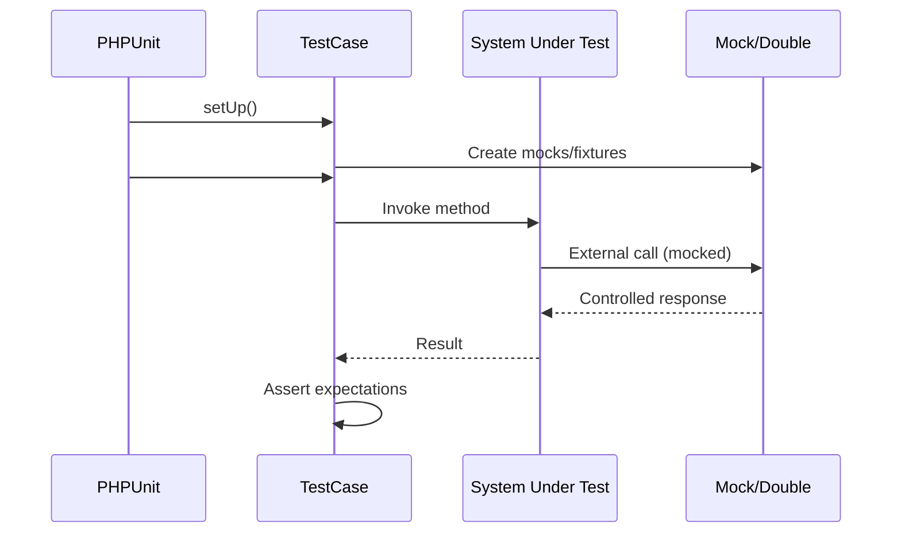

# Design Document: Unit Test Suite

## Overview

This design describes a comprehensive PHPUnit 11 test suite for the
`simsoft/data-flow` ETL pipeline library. The suite validates correctness of all
public classes, traits, interfaces, and enums through unit tests, integration
tests, and property-based tests.

The test suite mirrors the source directory structure (`src/Foo.php` →
`tests/FooTest.php`) and uses PHPUnit 11 `#[Test]` attributes. External
dependencies (Flysystem, ActiveQuery, Spout, PhpSpreadsheet) are isolated via
mocks and test doubles. Property-based testing targets invariant properties of
the core transformers and pipeline orchestration.

### Design Decisions

1. **Mirror structure**: Test classes follow the same namespace/directory layout
   as source classes for discoverability.
2. **PHPUnit 11 attributes**: Use `#[Test]`, `#[DataProvider]`, `#[CoversClass]`
   attributes instead of docblock annotations.
3. **Mocking strategy**: PHPUnit's built-in mock builder for interfaces;
   concrete test doubles for vendored packages (Spout, ActiveQuery) that are
   difficult to mock.
4. **Property-based testing**: Use `phpunit/phpunit` with data providers
   generating randomized inputs (100+ iterations) for invariant properties. No
   external PBT library — PHPUnit data providers with random generation achieve
   the same goal within the existing toolchain.
5. **Fixture files**: Minimal `.xlsx` and `.csv` fixture files in
   `tests/fixtures/` for spreadsheet extractor/loader tests.
6. **Base test class**: A `TestCase` base class providing common helper
   methods (iterator-to-array conversion, assertion helpers).

## Architecture

```mermaid
graph TD
    subgraph "Test Suite Structure"
        A[tests/] --> B[TestCase.php - Base class]
        A --> C[DataFlowTest.php]
        A --> D[CallableProcessorTest.php]
        A --> E[PayloadTest.php]
        A --> F[ProcessorTest.php]
        A --> G[Enums/SignalTest.php]
        A --> H[Exceptions/]
        A --> I[Extractors/]
        A --> J[Transformers/]
        A --> K[Loaders/]
        A --> L[Traits/]
        A --> M[Integration/PipelineTest.php]
        A --> N[fixtures/]
    end

    subgraph "Mocking Layer"
        O[ActiveQuery Mock] --> I
        P[Flysystem InMemory Adapter] --> I
        Q[Spout Test Fixtures] --> I
        Q --> K
        R[PhpSpreadsheet Test Fixtures] --> I
        R --> K
    end
```



### Test Execution Flow



## Components and Interfaces

### Test Directory Layout

```
tests/
├── TestCase.php                          # Base test class with helpers
├── DataFlowTest.php                      # DataFlow pipeline orchestration
├── CallableProcessorTest.php             # CallableProcessor closure wrapping
├── PayloadTest.php                       # Payload container
├── ProcessorTest.php                     # Processor abstract base (via concrete stub)
├── Enums/
│   └── SignalTest.php                    # Signal enum values
├── Exceptions/
│   ├── DataFlowExceptionTest.php
│   ├── ExtractorExceptionTest.php
│   ├── TransformerExceptionTest.php
│   ├── LoaderExceptionTest.php
│   └── InvalidCallableExceptionTest.php
├── Extractors/
│   ├── IterableExtractorTest.php
│   ├── SpoutExtractorTest.php
│   ├── SpreadsheetExtractorTest.php
│   ├── ActiveQueryExtractorTest.php
│   └── FileFinderExtractorTest.php
├── Transformers/
│   ├── ChunkTest.php
│   ├── FilterTest.php
│   └── MappingTest.php
├── Loaders/
│   ├── PreviewTest.php
│   ├── VisualizeTest.php
│   ├── SpoutLoaderTest.php
│   └── SpreadsheetLoaderTest.php
├── Traits/
│   ├── DataFrameTest.php
│   ├── CallableDataFrameTest.php
│   └── MacroableTest.php
├── Integration/
│   └── PipelineTest.php                  # End-to-end pipeline tests
├── Properties/
│   └── TransformerPropertiesTest.php     # Property-based tests
└── fixtures/
    ├── sample.xlsx                       # 3 rows, 2 sheets
    ├── sample.csv                        # 5 rows with headers
    └── empty.xlsx                        # Empty spreadsheet
```

### Base TestCase Class

```php
<?php

namespace Simsoft\DataFlow\Tests;

use Iterator;
use ArrayIterator;
use PHPUnit\Framework\TestCase as PHPUnitTestCase;

abstract class TestCase extends PHPUnitTestCase
{
    /**
     * Convert an Iterator to an array (consuming it).
     */
    protected function iteratorToArray(Iterator $iterator): array
    {
        $result = [];
        foreach ($iterator as $key => $value) {
            $result[$key] = $value;
        }
        return $result;
    }

    /**
     * Create an ArrayIterator from an array.
     */
    protected function arrayToIterator(array $data): ArrayIterator
    {
        return new ArrayIterator($data);
    }

    /**
     * Get path to a test fixture file.
     */
    protected function fixturePath(string $filename): string
    {
        return __DIR__ . '/fixtures/' . $filename;
    }
}
```

### PHPUnit Configuration (phpunit.xml)

```xml
<?xml version="1.0" encoding="UTF-8"?>
<phpunit xmlns:xsi="http://www.w3.org/2001/XMLSchema-instance"
         xsi:noNamespaceSchemaLocation="vendor/phpunit/phpunit/phpunit.xsd"
         bootstrap="vendor/autoload.php"
         colors="true"
         displayDetailsOnTestsThatTriggerDeprecations="true"
         displayDetailsOnTestsThatTriggerWarnings="true"
         failOnRisky="true"
         failOnWarning="true">
    <testsuites>
        <testsuite name="Unit">
            <directory>tests</directory>
            <exclude>tests/Integration</exclude>
            <exclude>tests/Properties</exclude>
        </testsuite>
        <testsuite name="Integration">
            <directory>tests/Integration</directory>
        </testsuite>
        <testsuite name="Properties">
            <directory>tests/Properties</directory>
        </testsuite>
    </testsuites>
    <source>
        <include>
            <directory>src</directory>
        </include>
    </source>
</phpunit>
```

### Mocking Strategy

| Dependency             | Mocking Approach                                                                          |
|------------------------|-------------------------------------------------------------------------------------------|
| `ActiveQuery`          | PHPUnit mock with `expects()->method('each')` returning a controlled collection           |
| `Flysystem Filesystem` | In-memory adapter (`League\Flysystem\InMemory\InMemoryFilesystemAdapter`) or PHPUnit mock |
| `SpoutIO` (vendored)   | Test fixture `.xlsx`/`.csv` files; integration-style tests reading real files             |
| `PhpSpreadsheet`       | Test fixture files; mock `IOFactory::load()` where needed                                 |
| `SpreadsheetIO`        | PHPUnit mock verifying `addRow()` and `saveAs()` calls                                    |
| `Psr16Cache`           | PHPUnit mock or `ArrayAdapter` from Symfony Cache                                         |

### Key Interfaces for Testing

```php
// Flowable — the core contract all stages implement
interface Flowable {
    public function __invoke(?Iterator $dataFrame = null): Iterator;
}

// Every test for a Processor subclass verifies this contract:
// Given a nullable Iterator input, produce an Iterator output.
```

## Data Models

### Test Data Structures

**Pipeline test data** — arrays of associative arrays representing rows:

```php
$rows = [
    ['id' => 1, 'name' => 'Alice', 'age' => 30],
    ['id' => 2, 'name' => 'Bob', 'age' => 25],
    ['id' => 3, 'name' => 'Charlie', 'age' => 35],
];
```

**Chunk test expectations**:

```php
// Input: [1, 2, 3, 4, 5], chunk size: 2
// Output: [[1, 2], [3, 4], [5]]
```

**Filter test expectations**:

```php
// Input: [1, 2, 3, 4, 5], predicate: $x > 2
// Output: [3, 4, 5] (preserving keys)
```

**Mapping test expectations**:

```php
// Input: ['first_name' => 'Alice', 'last_name' => 'Smith']
// Mapping: ['full_name' => fn($row) => $row['first_name'] . ' ' . $row['last_name']]
// Output: ['first_name' => 'Alice', 'last_name' => 'Smith', 'full_name' => 'Alice Smith']
```

### Fixture Files

| File          | Contents                                                           | Purpose                                               |
|---------------|--------------------------------------------------------------------|-------------------------------------------------------|
| `sample.xlsx` | 2 sheets: "Profile" (3 rows + header), "Address" (3 rows + header) | SpoutExtractor/SpreadsheetExtractor multi-sheet tests |
| `sample.csv`  | 5 rows with header row                                             | SpoutExtractor CSV tests                              |
| `empty.xlsx`  | Single empty sheet                                                 | Edge case: empty spreadsheet                          |

## Correctness Properties

*A property is a characteristic or behavior that should hold true across all
valid executions of a system — essentially, a formal statement about what the
system should do. Properties serve as the bridge between human-readable
specifications and machine-verifiable correctness guarantees.*

### Property 1: Chunk Count Preservation

*For any* non-empty input array and *for any* positive integer chunk size, the
total number of items across all chunks produced by the Chunk transformer SHALL
equal the number of items in the original input.

**Validates: Requirements 10.6**

### Property 2: Filter Key Preservation

*For any* input array with explicit keys and *for any* predicate closure, the
set of keys in the Filter transformer's output SHALL be a subset of the keys in
the input.

**Validates: Requirements 11.5**

### Property 3: Filter Metamorphic Count

*For any* input array and *for any* predicate closure, the number of items
yielded by the Filter transformer SHALL be less than or equal to the number of
items in the input.

**Validates: Requirements 11.6**

### Property 4: Identity Pipeline Round-Trip

*For any* non-empty array of values, passing the array through a DataFlow
pipeline with an identity transformation (returning each item unchanged) SHALL
produce output equal to the input.

**Validates: Requirements 21.7**

### Property 5: Payload Reset Round-Trip

*For any* set of initial attributes and *for any* sequence of modifications (
set, unset operations), calling `reset()` on the Payload SHALL restore all
attributes to the initial constructor state.

**Validates: Requirements 3.10, 3.2**

### Property 6: IterableExtractor Round-Trip

*For any* array of values, constructing an IterableExtractor with that array and
invoking it SHALL yield an Iterator containing exactly the same items in the
same order.

**Validates: Requirements 5.4**

## Error Handling

### Exception Hierarchy

```
RuntimeException
└── DataFlowException
    ├── ExtractorException
    ├── TransformerException
    └── LoaderException

InvalidArgumentException
└── InvalidCallableException
```

### Error Scenarios Tested

| Scenario                                    | Exception                  | Test Location              |
|---------------------------------------------|----------------------------|----------------------------|
| `preview(0)` or `preview(-1)`               | `DataFlowException`        | `DataFlowTest`             |
| Non-callable to `CallableProcessor`         | `InvalidCallableException` | `CallableProcessorTest`    |
| Non-iterable to `IterableExtractor`         | `Exception`                | `IterableExtractorTest`    |
| Invalid file path to `SpoutExtractor`       | `ExtractorException`       | `SpoutExtractorTest`       |
| Non-existent file to `SpreadsheetExtractor` | `Exception`                | `SpreadsheetExtractorTest` |
| Invalid file path to `SpoutLoader`          | `LoaderException`          | `SpoutLoaderTest`          |
| Non-array data to `SpoutLoader`             | `UnsupportedTypeException` | `SpoutLoaderTest`          |
| Error callback in `CallableDataFrame`       | `DataFlowException`        | `CallableDataFrameTest`    |
| Undefined macro method call                 | `BadMethodCallException`   | `MacroableTest`            |

### Error Testing Strategy

- Use `$this->expectException(ExceptionClass::class)` for expected exceptions
- Use `$this->expectExceptionMessage('...')` to verify error messages
- Test both the exception type and that the operation does not produce partial
  output

## Testing Strategy

### Dual Testing Approach

1. **Unit tests** — verify specific examples, edge cases, and error conditions
   for each class in isolation
2. **Property-based tests** — verify universal invariants across randomized
   inputs (100+ iterations per property)
3. **Integration tests** — verify end-to-end pipeline composition with multiple
   stages

### Property-Based Testing Configuration

- **Library**: PHPUnit data providers with randomized input generation (no
  external PBT library needed)
- **Iterations**: Minimum 100 random inputs per property test
- **Location**: `tests/Properties/TransformerPropertiesTest.php`
- **Tag format**: `Feature: unit-test-suite, Property {number}: {property_text}`

Each property test uses a `#[DataProvider]` that generates 100+ random test
cases:

```php
public static function chunkCountProvider(): \Generator
{
    for ($i = 0; $i < 100; $i++) {
        $size = random_int(1, 100);
        $input = range(1, $size);
        $chunkSize = random_int(1, 50);
        yield "size={$size},chunk={$chunkSize}" => [$input, $chunkSize];
    }
}
```

### Test Organization by Suite

| Suite       | Purpose                        | Run Command                                |
|-------------|--------------------------------|--------------------------------------------|
| Unit        | All class-level tests          | `composer test -- --testsuite Unit`        |
| Integration | End-to-end pipeline tests      | `composer test -- --testsuite Integration` |
| Properties  | Property-based invariant tests | `composer test -- --testsuite Properties`  |

### Mocking Guidelines

1. **PHPUnit mocks** for interfaces and abstract classes (`ActiveQuery`,
   `Filesystem`)
2. **Real fixture files** for spreadsheet extractors/loaders (small files, fast
   I/O)
3. **Output buffering** (`ob_start()`/`ob_get_clean()`) for `Preview` and
   `Visualize` loaders
4. **Temp directory** (`sys_get_temp_dir()`) for loader file-writing tests with
   cleanup in `tearDown()`
5. **Concrete test doubles** (anonymous classes extending abstract) for
   `Processor`, `Extractor`, `Transformer`, `Loader`

### Coverage Goals

- All public methods of every class have at least one test
- All exception paths are exercised
- All Signal enum behaviors are verified in context
- Property tests cover the core invariants of Chunk, Filter, IterableExtractor,
  Payload, and DataFlow pipeline
