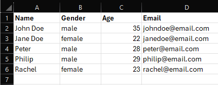

# Processors

The package come with some useful processors.

## IterableExtractor

Extract data from iterable data source.

```php
use Simsoft\DataFlow\DataFlow;
use Simsoft\DataFlow\Extractors\IterableExtractor;

// From array.
(new DataFlow())
    ->from(new IterableExtractor([1, 2, 3]))
    ->load(function($num) {
        echo $num . "\n";
    })
    ->run();

// From iterator
$dataSource = fn() => yield from range(1, 10);

(new DataFlow())
    ->from(new IterableExtractor($dataSource()))
    ->load(function($num) {
        echo $num . "\n";
    })
    ->run();
```

Or simply passing iterable data source directly.

```php
use Simsoft\DataFlow\DataFlow;

// From array.
(new DataFlow())
    ->from([1, 2, 3])
    ->load(function($num) {
        echo $num . "\n";
    })
    ->run();

// From iterator
$dataSource = fn() => yield from range(1, 10);

(new DataFlow())
    ->from($dataSource())
    ->load(function($num) {
        echo $num . "\n";
    })
    ->run();
```

## SpreadsheetExtractor

Extract data from spreadsheet file.

```php
use Simsoft\DataFlow\DataFlow;
use Simsoft\DataFlow\Extractors\SpreadsheetExtractor;

(new DataFlow())
    ->from(new SpreadsheetExtractor('/path/to/file.xlsx')) // or .xls, .csv
    ->load(function(array $row) {
        echo $row['name'] . "\n";  // use header name as key to access row content.
    })
    ->run();
```

## LocalFileExtractor

Extract file and directory paths from a given directory.

```php
use League\Flysystem\DirectoryAttributes;
use League\Flysystem\FileAttributes;
use Simsoft\DataFlow\DataFlow;
use Simsoft\DataFlow\Extractors\LocalFileExtractor;

(new DataFlow())
    ->from((new LocalFileExtractor('/path/to/directory'))->recursive()) // search recursively.
    ->load(function(FileAttributes|DirectoryAttributes $file) {
        if ($file->isDir()) {
            echo 'Is directory: ' . $file->path() . "\n";
        } else {
            echo 'Is file' . $file->path() . "\n";
        }
    })
    ->run();

// Output:
// Is file: /path/to/directory/file1.txt
// Is directory: /path/to/directory/subdirectory
// Is file: /path/to/directory/subdirectory/file3.txt
// Is file: /path/to/directory/subdirectory/file4.txt
// Is directory: /path/to/directory/subdirectory/lvl2directory
```

Extract file path only.

```php
(new DataFlow())
    ->from((new LocalFileExtractor('/path/to/directory'))->recursive()->fileOnly()) // get file only..
    ->load(function(FileAttributess $file) {
        echo 'Is file' . $file->path() . "\n";
    })
    ->run();

// Output:
// Is file: /path/to/directory/file1.txt
// Is file: /path/to/directory/subdirectory/file3.txt
// Is file: /path/to/directory/subdirectory/file4.txt
```

Extract directory path only.

```php
(new DataFlow())
    ->from((new LocalFileExtractor('/path/to/directory'))->recursive()->directoryOnly()) // get file only..
    ->load(function(FileAttributess $file) {
        echo 'Is directory: ' . $file->path() . "\n";
    })
    ->run();

// Output:
// Is directory: /path/to/directory/subdirectory
// Is directory: /path/to/directory/subdirectory/lvl2directory
```

## ActiveQueryExtractor

Extract data from ActiveQuery.

```php
use Simsoft\DataFlow\DataFlow;
use Simsoft\DataFlow\Extractors\ActiveQueryExtractor;
use Simsoft\DB\MySQL\Connection;
use Simsoft\DB\MySQL\Model;

Connection::configure([
    'default' => [
        'driver' => 'mysql',
        'host' => env('DB_HOST'),
        'username' => env('DB_USERNAME'),
        'password' => env('DB_PASSWORD'),
        'port' => env('DB_PORT'),
        'database' => env('DB_DATABASE'),
        'charset' => 'utf8mb4',
    ]
]);

class User extends Model
{
    protected string $connection = 'default';
    protected string $table = 'user';
    protected string|array $primaryKey = 'id';
}

$query = User::find()->where('gender', 'male')->where('age', '>', 20);

(new DataFlow())
    ->from(new ActiveQueryExtractor($query))
    ->load(function(User $user) {
        echo "$user->name is over 20 years old" . PHP_EOL;
    })
    ->run();

// Output:
// John Doe is over 20 years old
// Jane Doe is over 20 years old
```

## SpreadsheetLoader

Load data into spreadsheet file using **mapping** method.

```php
use Simsoft\DataFlow\DataFlow;
use Simsoft\DataFlow\Loaders\SpreadsheetLoader;

$query = User::find()->where('gender', 'male')->where('age', '>', 20);

(new DataFlow())
    ->from(new ActiveQueryExtractor($query))
    ->map([  // Array key will be the header.
        'Name' => fn(User $model) => $model->name,
        'Gender' => fn(User $model) => $model->gender,
        'Age' => fn(User $model) => $model->age,
        'Email' => fn(User $model) => $model->email,
    ])
    ->load(new SpreadsheetLoader('/path/to/users.xlsx'))
    ->run();
```

Load data into spreadsheet file using **callback** method.

```php
use Simsoft\DataFlow\DataFlow;
use Simsoft\DataFlow\Loaders\SpreadsheetLoader;

$query = User::find()->where('gender', 'male')->where('age', '>', 20);

(new DataFlow())
    ->from(new ActiveQueryExtractor($query))
    ->transform(function(User $model) {
        return [  // Array key will be the header.
            'Name' => $model->name,
            'Gender' => $model->gender,
            'Age' => $model->age,
            'Email' => $model->email,
        ]
    })
    ->load(new SpreadsheetLoader('/path/to/users.xlsx'))
    ->run();
```

**users.xlsx**


